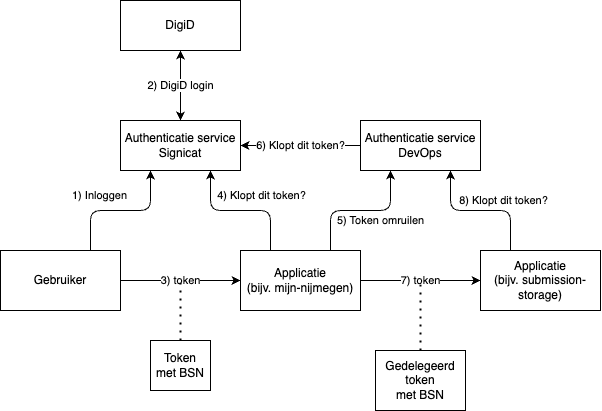

# API Authenticatie en Authorizatie
Het DevOps team is in de innovatiesprint (3 tot 14 juni 2024) bezig geweest met API authenticatie en authorisatie. Dit document is bedoeld om een niet al te technisch te beschijven wat wij hebben gedaan en getest.

## Basis
In de basis wat wij hebben gebouwd is een manier van [zero-trust authenticatie](https://www.ncsc.nl/actueel/weblog/weblog/2020/what-about-zero-trust). In de basis komt dit neer op `never trust, always verify`. 

1. De gebruiker komt bij mijn-nijmegen en wordt doorgestuurd naar Signicat (onze authenticatie broaker).
2. De gebruiker logt in met DigiD en wordt teruggestuurd naar Signicat.
3. Signicat geeft de gebruiker een token op de achtergrond.
4. De gebruiker kan met dit token inloggen bij mijn-nijmegen. Daarbij wordt gecontroleerd of het token klopt (bij Signicat) en wie de gebruiker is op basis van de informatie in het token.
5. Mijn-nijmegen moet vervolgens om bij het een achterliggend systeem een API aan te roepen het token van de gebruiker inwisselen voor een nieuw token (bij de DevOps authenticatie service). Dit nieuwe token is voor mijn-nijmegen, maar mijn-nijmegen kan alleen dingen bevragen namens de user van wie het originele token is. De informatie van de user wordt dus ook in het nieuwe token opgenomen. Je zou kunnen zeggen: 'mijn-nijmegen handeld namens de gebruiker'.
6. Mijn-nijmegen bevraagt de submission-storage (een database van ingezonden formulieren) met het nieuw verkregen token, namens de gebruiker.
7. De submission-storage controleert of het token valide is en of de gevraagde gegevens opgevraagd mogen worden door deze gebruiker (authorisatie). Een gebruiker van mijn-nijmegen mag bijvoorbeeld alleen de eigen formulieren inzien.

## Waarom is dit intressant?

### Authorisatie van gebruikers
Door in het geledegeerde token op te nemen namens wie het request wordt uitgevoerd is er er een stukje authenticatie informatie bij de API. Dit extra stukje informatie kan worden gebruikt om een audit trail op te bouwen (logging) maar ook om extra authorizatie toe te passen. Zo kan afgedwongen worden dat een gebruiker alleen gegevens te zien krijgt die bij de identitieit opgenomen in het token horen. 

Hoe is dit een vooruitgang op de bestaande situatie? Momenteel wordt mijn-nijmegen altijd vertrouwd wordt door achterliggende systemen. Met de secrets waarmee mijn-nijmegen momenteel de achterliggende APIs bevraagd wordt geen authorisatie informatie mee gegeven. Dit principe schaalt ook naar andere situaties, zoals de situatie waarin de gebruiker een medewerker is (denk aan BRP protocollering).

### Authorisatie op APIs
Het is mogelijk om in het token ook de rollen en rechten op te nemen die een systeem of gebruiker heeft bij het bevragen van een API. Zo kan een API eenvoudig definieren welke rechten nodig zijn en hierop controleren in het token. Deze rollen en rechten worden bepaald door de authenticatie service, dit betekent dus dat rollen en rechten management voor communicatie tussen systemen wordt gecentraliceerd.

### Gebruik van standaarden
De oplossing die we hebben gebouwd maakt gebruik van bewezen en beedgedragen industrie standaarden. Hierbij hebben we ook gekeken naar hoe we kunnen voldoen aan de NL API Strategie, een nationale strategie en specificiatie bovenop de eerder genoemde industrie standaarden.

## Gebruikte standaarden
Dit zijn de belangrijkste staandaarden waar we gebruik van hebben gemaakt bij onze proef implementatie.
- OAuth [RFC6749](https://datatracker.ietf.org/doc/html/rfc6749) (specifiek het `client_credentials` grant type).
- OAuth token exchange [RFC8693](https://datatracker.ietf.org/doc/html/rfc8693). Gebruikt voor het uitwisselen van tokens verkregen bij een andere authenticatie service met eigen tokens die gebruikt kunnen worden op onze APIs.
- [OpenID Connect](https://openid.net/specs/openid-connect-core-1_0.html)
- [NL Gov profile for OAuth](https://logius-standaarden.github.io/OAuth-NL-profiel/). Nog in consultatie ten tijden van de innovatiesprint.

## Detail flow
Hieronder is in meer detail de flow van het gebruikte voorbeeld uitgewerkt.

